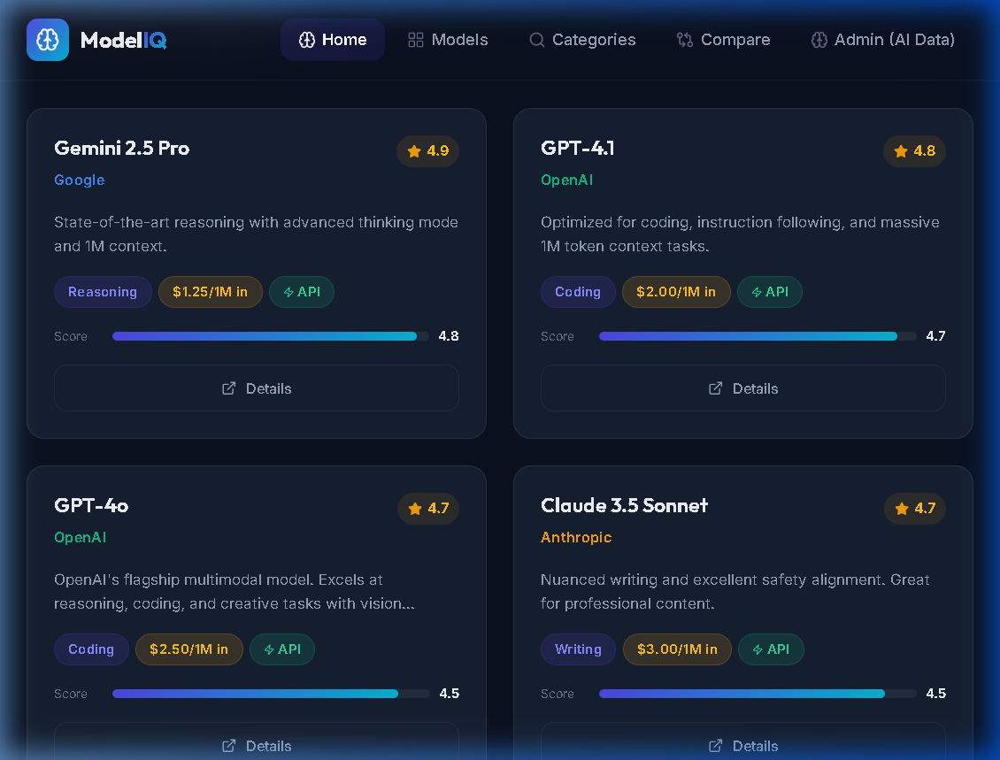
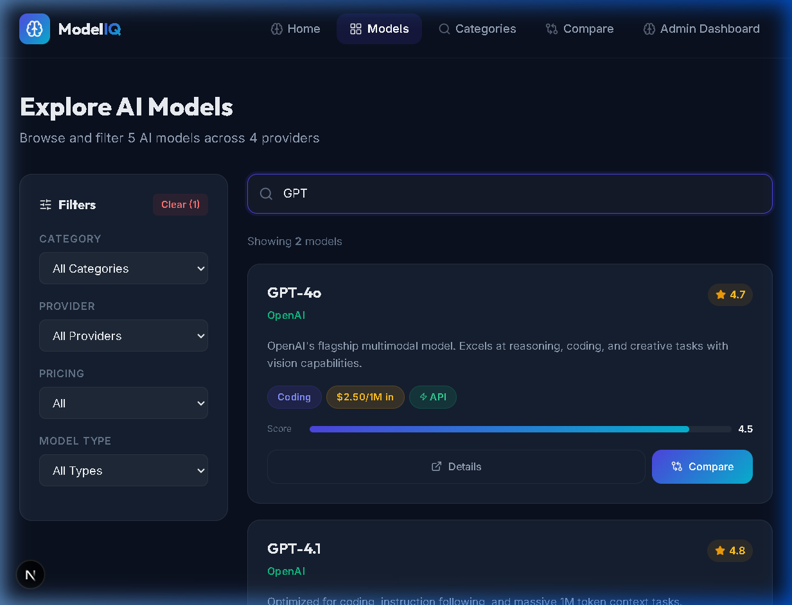
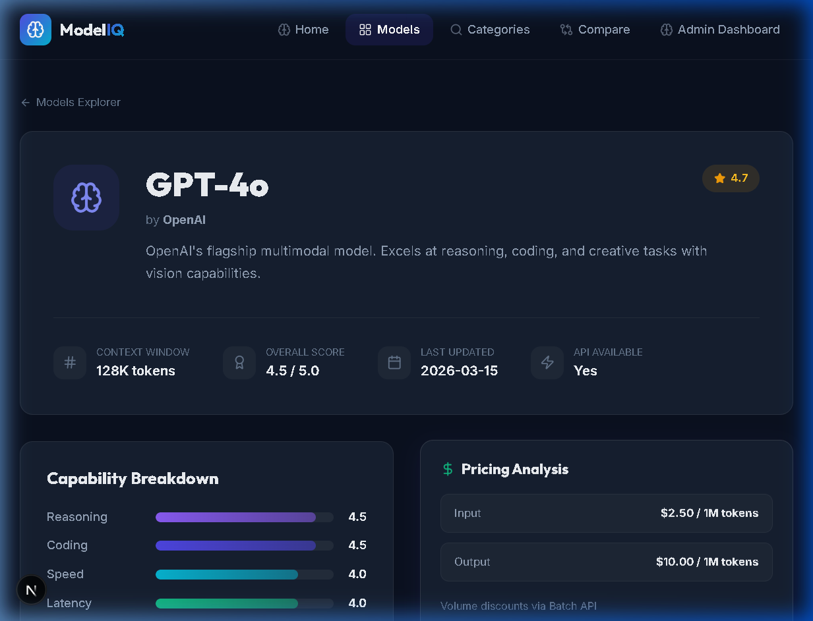
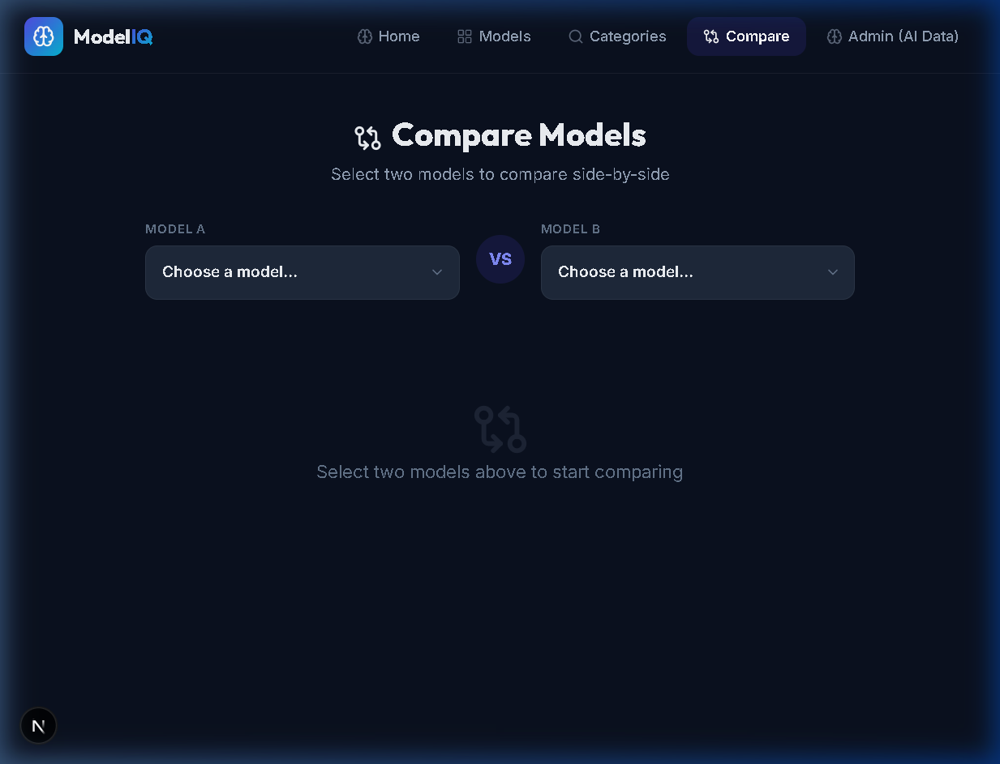
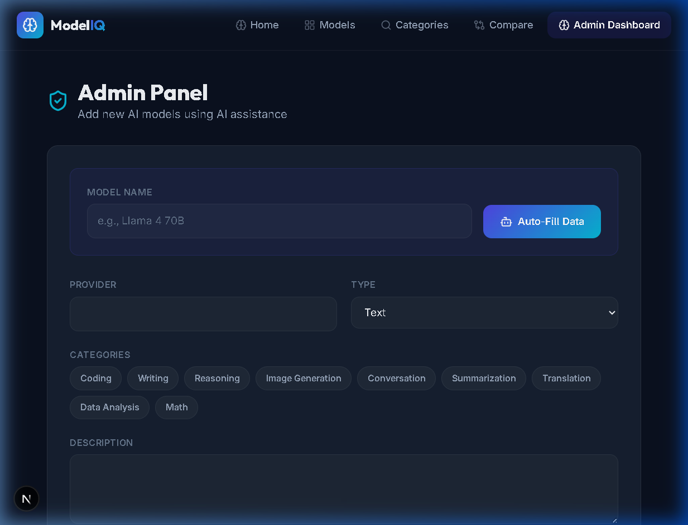
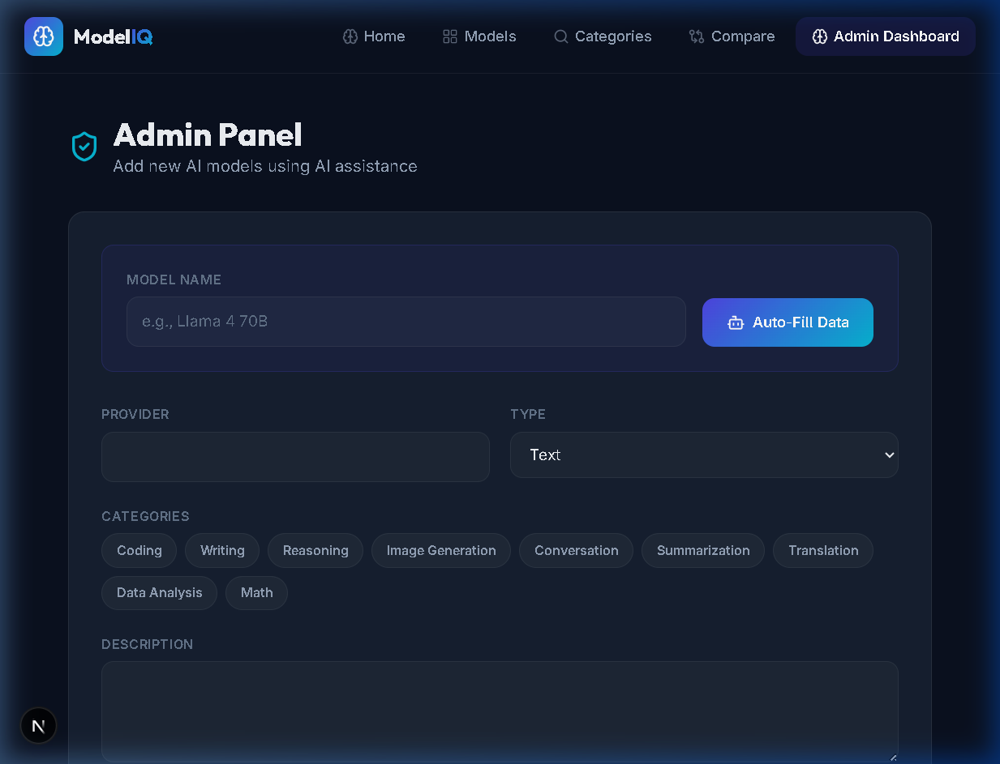

# 🧠 ModelIQ — Advanced LLM Intelligence & Benchmarking Platform


**ModelIQ** is a high-performance, premium intelligence platform engineered to provide clarity in the rapidly evolving landscape of Artificial Intelligence. Built for developers, researchers, and enterprise decision-makers, ModelIQ offers a centralized hub to explore, compare, and analyze the world's most sophisticated Large Language Models (LLMs) through empirical data and deep metrics.

[**🌐 Explore the Live Platform**](https://ai11-omega.vercel.app)

---

## ✨ Core Value Propositions

- **Data-Driven Comparison:** Perform exhaustive side-by-side analysis of reasoning, coding, and latency metrics.
- **Economic Transparency:** High-precision pricing data standardized per 1 million tokens for both input and output.
- **Architectural Insights:** Deep dives into context window utilization, modality support (Text, Image, Video), and API availability.
- **Premium User Experience:** A state-of-the-art, dark-themed interface built with a focus on high-density data visualization and smooth micro-interactions.

---

## 📸 Platform Interface

<div align="center">
  <table border="0">
    <tr>
      <td align="center"><b>Main Explorer</b><br/></td>
      <td align="center"><b>Search & Discovery</b><br/></td>
    </tr>
    <tr>
      <td align="center"><b>Detailed Metrics</b><br/></td>
      <td align="center"><b>Comparison Engine</b><br/></td>
    </tr>
    <tr>
      <td align="center"><b>Admin Interface</b><br/></td>
      <td align="center"><b>Mobile Experience</b><br/></td>
    </tr>
  </table>
</div>

## 🧠 Technical Challenges I Overcame

Building a data-heavy benchmarking platform presented several complex challenges:

1. **High-Density Data Visualization:**
   - *Challenge:* Displaying complex JSON metrics (reasoning scores, coding benchmarks, latency) for multiple models simultaneously without overwhelming the user interface.
   - *Solution:* I engineered a responsive CSS Grid system combined with atomic React components to dynamically render metrics based on the screen size, ensuring readability on both 4K monitors and mobile devices.
2. **Efficient Supabase Data Fetching:**
   - *Challenge:* Querying the database for highly nested model capabilities (Modality, API status, token limits) caused slow initial load times.
   - *Solution:* I utilized Next.js Server Components to fetch and cache the Supabase data on the server, drastically reducing client-side payload and achieving sub-second page loads.

---

## 🛠 Engineering Stack

| Layer | Technology |
| :--- | :--- |
| **Frontend** | [Next.js 15](https://nextjs.org/) (App Router, Server Components) |
| **Styling** | [Tailwind CSS 4.0](https://tailwindcss.com/) + [Lucide React](https://lucide.dev/) |
| **Architecture** | Atomic Component Design, Glassmorphism UX |
| **Database** | [Supabase](https://supabase.com/) (PostgreSQL) |
| **Deployment** | [Vercel](https://vercel.com/) |

---

## 🚀 Deployment & Local Setup

### 1. Repository Initialization
```bash
git clone https://github.com/Maamoun0/ModelIQ.git
cd ModelIQ
```

### 2. Dependency Management
```bash
npm install
```

### 3. Environment Configuration
Create a `.env.local` file with your secure credentials:
```env
NEXT_PUBLIC_SUPABASE_URL=your_supabase_endpoint
NEXT_PUBLIC_SUPABASE_ANON_KEY=your_public_anon_key
```

### 4. Database Setup
Execute the SQL schemas found in the `supabase/` directory within your Supabase SQL Editor:
1. `schema.sql` — Initializes table structures and relationships.
2. `seed.sql` — Populates the platform with initial high-performance model data.

### 5. Launch Development Server
```bash
npm run dev
```
Navigate to `http://localhost:3000` to access the localized instance.

---

## 📄 License

This software is distributed under the MIT License. See `LICENSE` for more information.

---

**Designed & Engineered with Precision by [Ahmed Maamoun](https://github.com/Maamoun0)**
